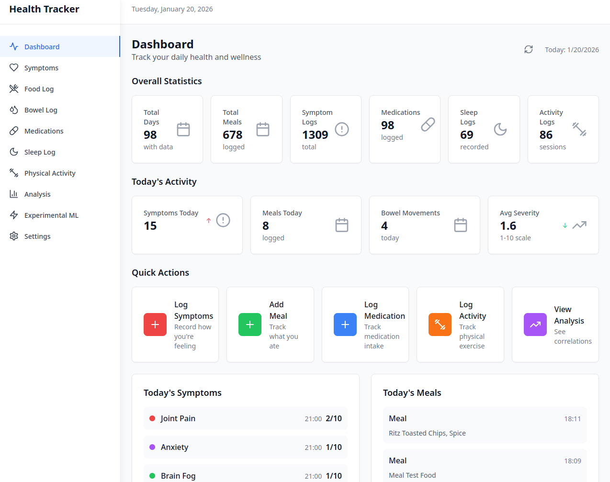
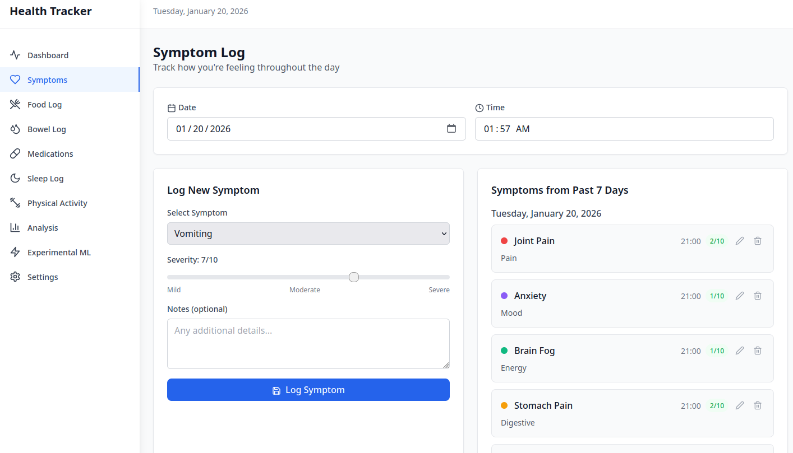
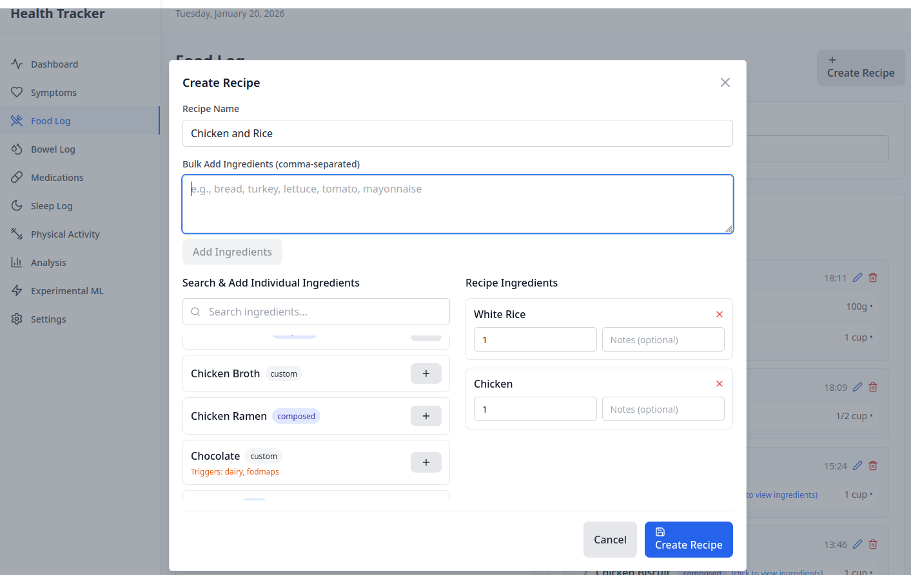
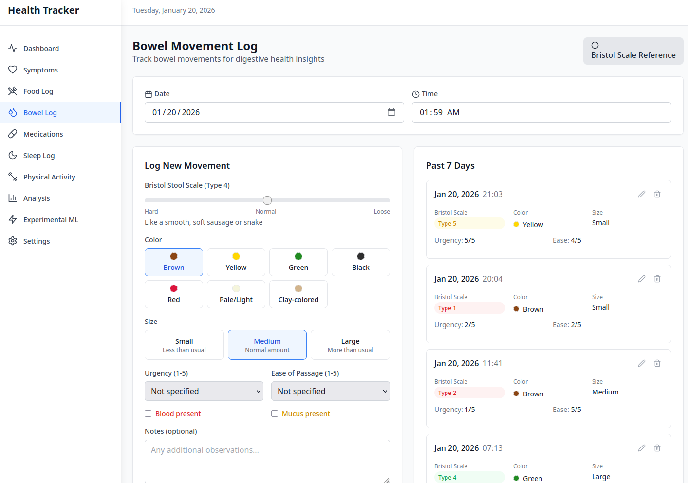

# Health Tracker

A web application for tracking daily symptoms and food intake to identify correlations between diet and medical issues.

## Features

- **Symptom Tracking** - Log symptoms with severity scales (1-10), categorized by type (Digestive, Energy, Mood, Pain)
- **Food & Meal Logging** - Track meals with timing, create recipes, and bulk-add ingredients
- **Bowel Movement Tracking** - Bristol stool scale, color, size, urgency, and additional health indicators
- **Medication Logging** - Track medications with dosage, timing, and multiple forms (pill, liquid, capsule)
- **Sleep Tracking** - Specialized sleep logging with disruption causes and next-day fatigue correlation
- **Physical Activity** - Log exercises with duration, intensity, and calories burned across 30+ activity types
- **Correlation Analysis** - Statistical analysis to identify food triggers and beneficial foods
- **Experimental ML Analysis** - Machine learning-based pattern detection with hourly exposure tracking
- **Data Export/Import** - Full backup and restore functionality
- **Dark Mode** - Complete dark/light theme support
- **Mobile Responsive** - Works on desktop and mobile devices

## Screenshots

| Dashboard | Symptom Tracking |
|-----------|------------------|
|  |  |

| Food Log & Recipes | Bowel Movement Tracking |
|--------------------|-------------------------|
|  |  |

## Quick Start

1. Install dependencies:
   ```bash
   npm run install:all
   ```

2. Start development servers:
   ```bash
   npm run dev
   ```

3. Open http://localhost:3000 in your browser

## Authentication Setup

Before first use, you need to configure authentication:

1. **Generate a password hash:**
   ```bash
   cd server
   npm run generate-password
   ```

2. **Create a `.env` file** in the server directory with your credentials:
   ```bash
   cp .env.example .env
   # Edit .env and add your AUTH_PASSWORD_HASH
   ```

3. **Default username is `user`** (customizable via `AUTH_USERNAME` in `.env`)

## Project Structure

```
health-tracker/
├── client/          # React frontend (Vite)
├── server/          # Express.js backend
├── shared/          # Shared types and utilities
├── docs/            # Documentation
└── PROJECT_PLAN.md  # Detailed project specification
```

## Development

- Frontend: React + Vite + Tailwind CSS (http://localhost:3000)
- Backend: Express.js + TypeScript + SQLite (http://localhost:3001)
- Charts: Recharts for data visualization

## Available Scripts

- `npm run dev` - Start both client and server in development mode
- `npm run build` - Build both client and server for production
- `npm run test` - Run tests for both client and server
- `npm run lint` - Run ESLint on the entire project
